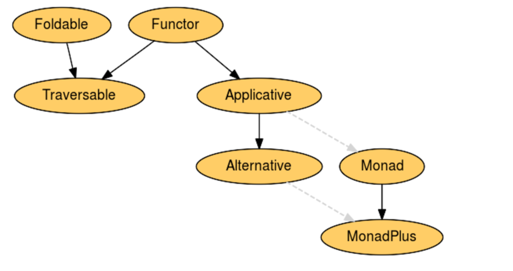

### Type constraints

```hs
(Ord a, Num a) => a -> a -> Ordering
```

The tuple of constraints does
represent a product, or conjunction, of constraints.

In case of type signatures with multiple arguments,
type bracketing happens at the right.
e.g.
```hs
f :: a -> a -> a
-- associates to
f :: a -> (a -> a)

map :: (a -> b) -> [a] -> [b]
-- associates into
map :: (a -> b) -> ([a] -> [b])
```
This kind of bracketing helps us understand that each `->` only has one argument 
and one result i.e. currying is happening.


### Currying and Uncurrying

```hs
let curry f a b = f (a, b)
curry :: ((t1, t2) -> t) -> t1 -> t2 -> t

let uncurry f (a, b) = f a b
uncurry :: (t1 -> t2 -> t) -> (t1, t2) -> t
```


### Type application in type signature

`Parantheses` in type signature are important. 
e.g. if type is `f (g a)`, you cannot ignore the parantheses. 

`Type terms` in a type signature also associate to left, i.e. default application order is left first.
e.g.
`data MTT a b c d = MTT a b c d`
We can write `MTT a b c d` as `((((MTT a) b) c) d)`
The meaning of the brackets/parantheses is same as that for normal values:
It means group together/ happens before/together.


### Monomorphism restriction

If you forget to provide a type signature, sometimes this rule will fill the free type variables with specific types using "type defaulting" rules. The resulting type signature is always less polymorphic than you'd expect, so often this results in the compiler throwing type errors at you in situations where you expected it to infer a perfectly sane type for a polymorphic expression.

The restriction is turned on by default in compiled modules, and turned off by default at the GHCi prompt.

In GHCi:
```hs
let pp = (+)
-- :t pp = Num a => a -> a -> a
```

In compile modules:
```hs
let pp = (+)
-- :t pp = Integer -> Integer -> Integer
```

### Type polymorphism

ith respect to Haskell, the principal type is the most generic
type which still typechecks. More generally, Principal type is a
property of the type system you’re interacting with. Principal
typing holds for that type system if a type can be found for a
term in an environment for which all other types for that term
are instances of the principal type.

### Typeclasses

Typeclass instances we can magically derive
are `Eq`, `Ord`, `Enum`, `Bounded`, `Read`, and `Show`

Unlike other languages, Haskell does not provide universal stringification (Show / print) or equality (Eq (value equality) or pointer equality) as this is not always sound or safe

typeclass definition only allows single type parameter/variable by default.
e.g. `class monad m where ...` and m is the type parameter.

### Typeclass defaulting and co-ercion

Below are the given default values 
for given typeclass:
```hs
default Num Integer
default Real Integer
default Enum Integer
default Integral Integer
default Fractional Double
default RealFrac Double
default Floating Double
default RealFloat Double
```

### Ord typeclass

Ord extends upon `Eq`, since it is necessary
to have equality comparision in order to order elements.

Interface method: `compare`
`compare` returns one of `EQ`, `LT`, `GT`.

Other operators include comparision operators:
`>`, `<` which returns a `Bool`.

`max` and `min` operators return value of same polymorphic `a`.

Compound types like `[]`, `(,)`, `Either` etc can be Ord by peicewise Ord elements compared respectively.

### Explicit type annotation in Ghci

```hs
> let x::Int; x = read "1"
> x
1
```

### Data type definition

To the left side of the datatype definition, we are allowed the type constructor,
and type variables.

To the right side of the equals sign of datatype definition, we are allowed
data constructors along with `typevariables/concreteType/ExistingDataType`.

### 

Type checker will try to give variables the most generic/general/maximally polymorphic type based on the inferred knowledge.


We can declare more specific (monomorphic) functions from
more general (polymorphic) functions:
```hs
-- polymorphic id function
myid :: a -> a
myid x = x
-- co-erced to a specific type
(myid :: Integer -> Integer) 33 -- 33
```

Not the other way round:
we lost the generality
of `Num` when we specialized to `Integer`

```hs
let numId = id :: Num a => a -> a
let intId = numId :: Integer -> Integer
-- below line throws error
let altNumId = intId :: Num a => a -> a
-- throws long type error
```

Note: **Concrete types imply all the typeclass they provide**

e.g. 
```hs
-- since Int has Ord and Num instance, everything works
addWeird :: Int -> Int -> Int
addWeird x y =
if x > 1
then x + y
else x
```

### Pattern matching

Patterns are matched against values or data constructors, not types.

Pattern matching proceeds from left to right and outside to inside.

Data constructors come in handy on the left side of equal sign,
acting to destructure function arguments which are values made using 
data constructors.

Basically any destructuring to left of equal e.g. `(,)` does tuple destructuring
`[]` does array destructuring . any user defined data constructor to left of equal sign 
destructure passed in argument

### Case expressions

Case expressions go well with pattern matching:
The value of case expression is the value of the expression corresponding to 
the pattern that was successfully matched.
```
case expr of
    pt1 -> expr1
    pt2 -> expr2
```
**Note** - No pipes in case expressions like they are present in guards
Case expression along with let :
```hs
    isPalindrome xs =
        let same = xs == reverse xs in
        case same of
            True -> "Yes"
            False -> "No"
```

One can use `where` clause with case expressions
```hs
    isPalindrome xs =
        case same of
            True -> "Yes"
            False -> "No"
            where same = xs == reverse xs
```

One cannot match against variable values

e.g.
**will not work**
```hs
let kk = 1
let abc = 3
case abc of
    kk -> "is one"
    _ -> "not one"
```

Case expressions can have guards but in an interesting way:
whcih means case expr patters allow boolean guards!! which is quite handy
(https://www.haskell.org/onlinereport/haskell2010/haskellch3.html)
e.g.
```hs
    -- sep means separator
    getAllWords :: Char -> String -> [String]
    getAllWords sep sentence =
        let fft = takeWhile (/=sep) sentence
            lst = dropWhile (/=sep) sentence
            in
                case sentence of
                    "" -> []
                    (hd : rest)
                        | hd == sep -> getAllWords sep rest
                        | otherwise -> fft : getAllWords sep lst
```

### Guards

Guards are basically constraints for patterns.
Allowed along side function definitions with `=`.
and allowed along side case patterns with `->`.

`otherwise` is an alias for `True`
e.g.
```hs
isRight :: (Num a, Eq a) => a -> a -> a -> String
isRight a b c
    | a^2 + b^2 == c^2 = "Right ON"
    | otherwise        = "Not right"
```
**Note** - Equals sign appears in the statement sets, not before pipes

```hs
avgGrade :: (Fractional a, Ord a) => a -> Char
avgGrade x
    | y >= 0.9 = 'A'
    | y >= 0.8 = 'B'
    | y >= 0.7 = 'C'
    | y >= 0.59 = 'D'
    | y < 0.59 = 'F'
    where y = x / 100
```

Guards are not very good at exhaustive pattern matching compared `case` expressions,
so you must add `otherwise` at the last guard to fix warning `-Wincomplete-patterns`.

Multi argument guard expr:
```hs
    fB3 :: a -> a -> Bool -> a
    fB3 x y z
        | z == True = x
        | z == False = y
```

`Case with guards`:

Here we see pattern matches but guard does not, so
interpreter moves on to next pattern which is `_`.
```hs
kk = 2
case kk of
  1 -> "I am one"
  2   
    | False -> "Two but false"
  _ -> "I am rest of case"
-- prints "I am rest of case"
```


#### pattern guards

pattern guards are of the form `p <- e`, where `p` is a pattern (see Section 3.17) of type `t` and `e` is an expression type `t1`.
We usually see them in list comprehensions

#### Boolean guards

boolean guards are arbitrary expressions of type `Bool`.


### Higher order functions

To better understand how HOFs work syntactically, it’s worth
remembering how parentheses associate in type signatures.

```hs
flip :: (a -> b -> c) -> b -> a -> c
flip f x y = f y x
```

When there are no higher order functions, by default the brackets
associate to the right in type signatures, since all multi argument
signatures are curried implicitly


### Function composition

Remember in mathematics we use to have `g.f x`, which is also read as `g after f` on x.

```hs
(.) :: (b -> c) -> (a -> b) -> a -> c
```

All functions participating in composition should be single argument and single return

Usage of `$` along with composition
```hs
negate . sum $ [1,2,3,4,5]
(negate . sum ) [1,2,3,4,5]
negate (sum [1,2,3,4,5])
-- what happens without $
-- negate . (sum [1,2,3,4,5])
-- negate . 15
-- error since 15 is not a function
```

Interesting example:
```hs
 take 5 . filter odd . enumFrom $ 3
```

`print = (putStr . show)`
`print :: Show a => a -> IO ()`
`show :: Show a => a -> String`
`putStr :: String -> IO ()`
The point of print is to compose putStrLn and show so that we don’t
have to call show on its argument ourselves

### Recursion and Y Combinator


### lookup

lookup searches inside a list of tuples for a value that matches
the input and returns the paired value wrapped inside a Maybe
context.

```hs
lookup :: Eq a => a -> [(a, b)] -> Maybe b
```

#### lookup and zip work together often

e.g.
```hs
 (lookup 3 $ zip [1, 2, 3] [4, 5, 6])
```

### Bottom

`_|_` or `bottom` is a term used in haskell to refer to computations that do
not successfully result in a value.

Throw exceptions using `error strMsg`
e.g.
```hs
f :: Bool -> Int
f True = error "blah"
f False = 0
```

### Lists

Definition:
```hs
data [] a = [] | a : [a]
```

Haskell has some syntactic sugar to accommodate the use of lists
```hs
(1 : 2 : 3 : []) ++ (4 : [])
-- is same as
[1, 2, 3] ++ [4]
```

Range syntaxes:
```hs
[1..10] -- [1,2,3,4,5,6,7,8,9]
enumFrom 1 -- [1,2,3............Infinity]
enumFromTo 1 10 -- [1,2,3,4,5,6,7,8,9]
enumFromThenTo 1 3 10 -- [1,3,5,7,9]
```

Extracting portions of list
```hs
take :: Int -> [a] -> [a]
drop :: Int -> [a] -> [a]
splitAt :: Int -> [a] -> ([a], [a])
```

Taking/dropping/splitting out of empty list returns an empty list

Instead of specifying exact numbers to take drop, a useful version is
Predicate based taking/dropping
```hs
takeWhile :: (a -> Bool) -> [a] -> [a]
dropWhile :: (a -> Bool) -> [a] -> [a]
```
while iteration stops as soon as any iteratio returns false.
e.g.
```hs
takeWhile (=='a') "abracadabra"
-- a
takeWhile (>6) [1..10]
-- []
```

### List comprehensions

Simple list comprehension

```hs
[x^2 | x <- [1..10]]
-- [1, 4, 9, 16, 25, 36, 49, 64, 81, 100]
```

List comprehension with filter/predicates

```hs
[x^2 | x <- [1..10], rem x 2 == 0] -- filter out even ones from generated nums, then feed to function
-- [4, 16, 36, 64, 100]
```

Multiple generators, think of loop nesting in same manner as order found in the list comprehension:
```hs
[x^y | x <- [1..5], y <- [2, 3]]
-- [1, 1, 4, 8, 9, 27, 16, 64, 25, 125] 
```

Multiple generators with a filter
```hs
[x^y | x <- [1..10], y <- [2, 3], x^y < 200]
-- [1,1,4,8,9,27,16,64,25,125,36,49,64,81,100]
```

List comprhension with strings:
```hs
[x | x <- "Three Letter Acronym", elem x ['A'..'Z']]
-- "TLA"
```

#### List evaluation

The cons `:` can be evaluated lazily without evaluating elements.
e.g. `length [1, undefined, 3]` will not crash
Seeing properly
```hs
length [] = 0
length (_:xs) = 1 + length xs -- ignoring heads, so undefined is fine, only care about pattern matching cons
```

#### Transforming list values

`map` is only for arrays
`fmap` is for all kinds of functors , array is a functor.

#### zipping lists

zip takes a bunch of lists and zips them together into a single item
like a chain/zip does. the order of items in tuple is same as input order
```hs
zip :: [a] -> [b] -> [(a, b)]
```
**Note** - zip stops as soon as one of the lists runs out of values
e.g.
```hs
zip [1,2,3] [99]
-- [(1,99)]
```

`zipWith`: Takes a binary function,
and two lists, and returns
the list which is generated by applied function.

#### Folding

Think of it like this:
Instead of reconsing when mapping, a combiner is applied to reduce a list to a value.
Folding expects identity satisfied by combiner as a starting element.
E.g. identity for `(+)` is `0`.
Identity for `(*)` is `1`.
Identity for `++` is `[]`.

Implementation:
```hs
-- note in both cases (foldl and foldr), we deconstruct cons from left to right.

foldr :: (a -> b -> b) -> b -> [a] -> b
foldr f z [] = z
foldr f z (x:xs) = f x (foldr f z xs)
-- expansion in foldr looks like
-- f x1 (f x2 (f x3 (f x4 (f x5 ... (f xn acc)))))

foldl :: (b -> a -> b) -> b -> [a] -> b
foldl f acc [] = acc
foldl f acc (x:xs) = foldl f (f acc x) xs
foldl :: (b -> a -> b) -> b -> [a] -> b

-- expansion in foldl looks like
-- f (f (f (f (f ... (f acc x1) x2) x3) x4).. xn)
```

It is right associative, i.e. right most reductions happen first.
e.g.
`foldr (+) 0 [1, 2, 3]`
Into,
`(+) 1 ((+) 2 ((+) 3 0))`

Given this two-stage process and non-strict evaluation, if 𝑓 doesn’t
evaluate its second argument (rest of the fold), no more of the spine
will be forced. One of the consequences of this is that foldr can avoid
evaluating not just some or all of the values in the list, but some or
all of the list’s spine as well

If your folding function isn’t commutative, a left
fold can lead to a different result than a right fold of the same. e.g. `(^)`

If some function works with foldr, it can also work over foldl by passing in flip of the function.

Folding over infinite lists:
It is possible to fold over infinite lists, where combiner are lazy and/or
do not care about rest of the sequence, e.g. `||` or `&&`

Predicting type of `foldr`, `foldl`:

1. combiner function: for foldr, it is `lv -> iv -> iv` (unit comes after list, right type is preferred), 
for foldl, it is `iv -> lv -> iv` (unit comes before lists, left type is return)
2. initial value: type `a`.
3. list values: type `[b]`.
4. return value : same type as initial value always. type a.

```hs
-- derived from above
foldl:: (a -> b -> a) -> a -> [b] -> a
     -- replacing consistently
     :: (b -> a -> b) -> b -> [a] -> b


foldr:: (b -> a -> a) -> a -> [b] -> a
    -- replacing consistently
    :: (a -> b -> b) -> b -> [a] -> b
```


`foldr (\_ _ -> 9001) 0 [undefined]` or `foldr (\_ _ -> 9001) undefined [undefined]` returns 9001 due to lazy evaluation.
since folding function does not care about its arguments
but `foldr (\_ _ -> 9001) 0 undefined` will throw error.

Finding largest item in list using fold:
`foldr max 'a' "fear is the litztle death"` returns `z`

` foldl (flip (:)) [] (reverse [1..5])` is same as `foldr (:) [] [1,2,3,4,5]`


### Algebraic data types

`arity` - Constructors are said to be `nullary`, `unary` etc..

A type can be thought of enumeration of constructors that have zero or more arguments (being type variables/Concrete types/Other data types)

Data constructors that take more than one argument are called products.

#### The "Algebraicness"

The cardinality of a datatype is the number of possible values
it defines. That number can be as small as 0 or as large as infinite
(for example, numeric datatypes, lists). Knowing how many possible
values inhabit a type can help you reason about your programs.

Cardinality of Bool is 2
Cardinality of Int8 is 256

Data types with only nullary constructors only: Cardinality is same as number of constructors.

Datatypes that only contain a unary constructor always have the
same cardinality as the type they contain
e.g.
```hs
data Goats = Goats Int deriving (Eq, Show)
```

#### newtype

Exclusively for unary constructors.
A newtype cannot be a product type, sum type, or contain nullary
constructors, but it has a few advantages over a vanilla data declaration.

Implementation and perf:
t it has no runtime overhead, as it reuses the
representation of the type it contains. It can do this because it’s not
allowed to be a record (product type) or tagged union (sum type). The difference between newtype and the type it contains is gone by
the time the compiler generates the code.

newtype only allows single fields, and parentheses allow you to make a single field e.g.
`newtype Mytype f a = Mytype (f a)` is a valid definition,
but usually it is a good practice to define it with a record syntax e.g.
`newtype Mytype f a = Mytype { runMyType :: f a }`

#### newtype vs type alias

You can define typeclass instances for newtypes that differ from instances for their underlying type.(e.g. wrapped type is Bool, I can more typeclasses than Bool satisfies)

You cannot do that for type synonyms.

Use `{-# LANGUAGE GeneralizedNewtypeDeriving #-}` for reusing typeclass behavior or the wrapped type.


### how to write instance with typeclass constratins

`instance (assertion1, ..., assertionn) => className type1 ... typem where ...`
```hs
    class TooMany a where
        tooMany :: a -> Bool

    instance (Num a, TooMany a) => TooMany (a, a) where
        tooMany (b,c) = True
``` 

All details in https://www.microsoft.com/en-us/research/wp-content/uploads/1997/01/multi.pdf
and https://downloads.haskell.org/~ghc/7.0.1/docs/html/users_guide/type-class-extensions.html

### Sum types

Cardinality of sum types is the addition of cardinalities of their data constructors

```hs
data BigSmall =
    Big Bool
    | Small Bool
    deriving (Eq, Show)
```
Cardinality of this is 2 + 2 i.e. 4.

### Product types

Any data constructor with two or more type arguments is a product.

A product type's cardinality is the multiplication of cardinalities of its inhabitants.

e.g. `(Bool, Bool)` cardinality is 2 x 2 i.e. 4

A product is like a struct, i.e. it has abilities to carry multiple values in a single data constructor.

#### Record syntax

Record are convinient sugar for product types.

e.g.
```hs
data Person = MkPerson String Int deriving (Eq, Show)
jm = MkPerson "julie" 108
ca = MkPerson "chris" 16

-- extract/access name of a given person
namae :: Person -> String
namae (MkPerson s _) = s
```

Data is immutable in Haskell, so values carry with them the information about how they were
created.

```hs
-- There are two ways to declare stuff
-- 1.
data Person = Person String Int deriving (Eq, Show)

-- 2.
data HumanName = String
data HumanAge = Int
data Human = Human HumanName HumanAge deriving (Eq, Show)
```

```hs
data Product a b = Product a b deriving (Eq, Show)

-- both below are same
data FarmHouse = Farmhouse String Int deriving (Eq, Show)
type FarmHouse' = Product String Int

-- both below are same
data FF2 = FF2 String Int Bool
type FF2' = Product String (Product Int Bool)
```

Some other utility Types like `Product`:
```hs
data Id a =
    MkId a deriving (Eq, Show)

data Sum a b =
    First a
    | Second b
    deriving (Eq, Show)

data RecordProduct a b =
    RecordProduct { pFirst :: a, pSecond :: b } deriving (Eq, Show)

-- creating values of record
kk = RecordProduct { pFirst = "Hi", pSecond = 2 }
```


#### Infix type and data constructors

```hs
data Product a b =
a :&: b
deriving (Eq, Show)
-- 1 :&: 2
-- :t (1 :&: 2) :: (Num a, Num b) => Product a b
```


### As Patterns

Althought the name is "As" patterns the symbol used is `@`,
to retain the full pattern in case of pattern matching

```hs
f :: Show a => (a, b) -> IO (a, b)
f t@(a, _) = do
    print a
    return t

-- f (1, 2)
-- 1
-- (1, 2)
```


### smart constructors

Allow value construction only after validation.
e.g. if person name is empty, return nothing on construction.
```hs
data Person = Person Name Age deriving Show
mkPerson :: Name -> Age -> Maybe Person
mkPerson name age
| name /= "" && age >= 0 = Just $ Person name age
| otherwise = Nothing
```

#### Either data type

```hs
data Either a b = Left a | Right b
```
Useful in smart constructors e.g..
```hs
mkPerson :: Name -> Age -> Either PersonInvalid Person
```
Think of it as a better alternative to `MayBe` because `Maybe` will always give you `Nothing` in case
of a problem. Where as `Either` can return a custom string/structure telling you what went wrong.

As per convention,
Left is used for error constructors,
and Right for valid value constructors.
Convenetion- Left of Either is used for whatever case is going work to stop.

Even more generic and useful type:
```hs
-- short alias than using Either
type ValidateEntity a = Either [EntityInvalid] a
-- EntityInvalid is array of reasons/strings why it was invalid 

ageOkay :: Age -> Either [PersonInvalid] Age
ageOkay :: Age -> ValidateEntity Age
ageOkay age = case age >= 0 of
    True -> Right age
    False -> Left [AgeTooLow]

nameOkay :: Name -> Either [PersonInvalid] Name
nameOkay :: Name -> ValidateEntity Name
nameOkay name = case name /= "" of
    True -> Right name
    False -> Left [NameEmpty]

mkPerson :: Name -> Age -> Either [PersonInvalid] Person
mkPerson :: Name -> Age -> ValidateEntity Person
mkPerson name Age = mkPerson' (nameOkay name) (ageOkay age)

data PersonInvalid = NameEmpty | AgeTooLow deriving (Eq, Show)
mkPerson' :: Either [PersonInvalid] Name -> Either [PersonInvalid] Age -> Either [PersonInvalid] Person
-- or equivalent below
mkPerson' :: ValidateEntity Name -> ValidateEntity Age -> ValidateEntity Person
mkPerson' (Right nameOk) (Right ageOk) = Right (Person nameOk ageOk)
mkPerson' (Left badName) (Left badAge) = Left (badName ++ badAge)
mkPerson' (Left badName) _ = Left badName
mkPerson' _ (Left badAge) = Left badAge
```

Either is usually composable in form of sub-entities e.g. if one of the sub-entities goes left,
the entity itself also goes left. So higher order functions like `lift` etc. become useful here.


### Lifted and UnLifted types

- types with kind `*` are lifted
- types with kind `#` are unlifted.

Lifted type: A type that can be inhabited by `bottom`. These types are represented by pointer and include most of datatypes used and encountered.

Unlifted type: cannot be inhabitated by bottom. e.g. native machine types and raw pointers.

**Note** - Newtypes are a special case. The kind is `*`, but they are unlifted, because their representation is identical to type they contain, so newtype itself is not creating any new pointer beyond that of the type it contains, and it cannot be inhabitated by bottom.


### Higher kinded types

A type is said to be inhabited if there exist values of that type.
`*` is the only type that is inhabitatable.
so, The kind of a type variable is always `*`.


Type constructor with type variables, will have kind like `* -> *` etc. 
e.g. kind of Maybe is `* -> *`
```
:k Maybe Maybe
First argument should have kind '*',
but Maybe has kind '* -> *'

:k Maybe (Maybe Int)
Maybe (Maybe Int) :: *
```


The crux is Maybe's type variable cannot be anything other than concrete type, for e.g. a parametrized type constructor won't work.

```hs
data Example a = Blah | RoofGoats | Woot a
-- :k Maybe Example
-- crashes because first argument of Maybe should have kind * 

-- similarly :k Maybe [] throws type error
```

### Algebras

Typically implemented with typeclasses, that define set of operations.

Algebras are defined by their laws and useful principally for their laws. laws make up what algebras are.

#### semigroup

A semigroup is a binary associative operation.
```hs
  (<>) :: a -> a -> a
  GHC.Base.sconcat :: GHC.Base.NonEmpty a -> a
  GHC.Base.stimes :: Integral b => b -> a -> a
```
`<>` is the binary operation here, you can also refer to as `sappend`

#### Monoid

A monoid is binary associative operation with identity.
Also can be said as semigroup properties + identity element.

```hs
class Semigroup a => Monoid a where
  mempty :: a
  mappend :: a -> a -> a
  mconcat :: [a] -> a
  mconcat = foldr mappend mepty
```

Type of the `mempty` is same as the monoid instance type, for e.g. if we have `instace Monoid (Abc a) where ...`, then type of `mempty` is `Abc a`,
and `mappend`, `<>` also operate on the same type.

Monoid Laws (3 laws):
1. left identity
2. right identity
3. associativity

```hs
-- Identity laws
mappend mempty x = x
mappend x mempty = x
-- associativity
mappend x (mappend y z) = mappend (mappend x y) z
mconcat = foldr mappend mempty
```
Identity: some
value which, when combined with any other value, will always
return that other value.
e.g. `++` is operation and `[]` is identity.
In case of a `monoid`, the value of `identity` is specified via `mempty`.
so there comes the monoid law:
```hs
mappend mempty x = x
mappend x mempty = x
```

`[a]` is an instance of `monoid` typeclass.
```hs
instance Monoid [a] where
    mempty = []
    mappend = (++)
```

`<>` is same as `mappend` but being infix.

**Note** - Why is `Integer` not `monoid` instance?
In haskell, Each type should have unique instance for a given typeclass.
not two (Integer can have: (+, 0) or (*, 1))

#### Sum and Product datatpes in `Data.Monoid`

Since Num/Integer are not directly part of `monoid`,
monoid lib declares `Sum` and `Product`.

```
:i Sum

newtype Sum a = Sum { getSum :: a} -- constructor with record
instance Num a => Monoid (Sum a)

mappend (Sum 2) (Sum 44) -- Sum { getSum = 46}
mappend (Sum { getSum = 2}) (Sum 44) -- Sum {getSum = 46}

getSum (Sum 22)
-- 22

(Sum 2) <> (Sum 11) <> (Sum 9)
-- Sum { getSum = 22}
```

Monoid use cases: Sometimes this is to describe an API
for incrementally processing a large dataset, sometimes to describe
guarantees needed to roll up aggregations (think summation) in a
parallel, concurrent, or distributed processing framework.

Abelian/commutative monoid: the `mappend` is commutative.

Use with `foldr`: Remember `foldr` expects a combiner and unit value to start with?
Guess what `mappend` is your combiner, and `mempty` is your unit value to start with.

```hs
foldr mappend mempty ([2,3,4] :: [Product Int])
-- Product { getProduct = 24 }
```


When we have more than one potential
implementation for Monoid for a datatype, it’s most convenient to
use newtypes to tell them apart.

Mappending:  as a way to condense any set of values to a summary value.

`All` and `Any` are Bool monoids.

`All`: `All` mappend is conjunction (and).
`Any`: `Any` mappend is disjunction (or).

A newtype Bool wrapper
```hs
newtype All = All {getAll :: Bool}
newtype Any = Any {getAny :: Bool}

All True <> All False
-- All False
Any True <> Any False
-- Any True
```

`First` and `Last` newtypes for Maybe:
```hs
-- prefer first Just in two Maybes given to mappend
newtype First a = First {getFirst :: Maybe a}

-- prefer last Just in two Maybes given to mappend
newtype Last a = Last {getLast :: Maybe a}

First (Just 2) <> First (Just 4)
-- First { getFirst = Just 2}

Last (Just 2) <> Last (Just 4)
-- Last { getLast = Just 4 }

First Nothing `mappend` First Nothing
-- First { getFirst = Nothing }
```


`Maybe` is a valid monoid, only if the wrapped type is a `semigroup`.
It will just operate the wrapped items using the wrapped type's mappend and package everything back into a `Maybe`.
e.g.
```hs
instance Semigroup a => Monoid (Maybe a) -- Defined in `GHC.Bas

mappend (Just (Sum 2)) Nothing
-- Just (Sum {getSum = 2})

mappend (Just [1,1]) (Just [3,4])
-- Just [1,1,3,4]

(Just [2]) <> (Just [3]) <> (Just [4])
-- Just [2,3,4]

-- will give Type error
mappend (Just 1) (Just 2)
```

#### Declaring Monoid Instances

In the `Monoid` definition, we need to make a `Semigroup` instance first. which is the result of the monoid definition above.

e.g.
```hs
import Data.Monoid()
import Data.Semigroup()

newtype Listy a = Listy [a] deriving (Eq, Show)  
instance Semigroup (Listy a) where
    (<>) = mappend
instance Monoid (Listy a) where  
    mempty = Listy []
    mappend (Listy l) (Listy l') = Listy $ mappend l l'
```

#### Orphan instances

Orphan instances are still a problem even if duplicate instances
aren’t both imported into a module because it means your typeclass
methods will start behaving differently depending on what modules are imported, which breaks the fundamental assumptions and
niceties of typeclasses.


There are a few solutions for addressing orphan instances:
1. You defined the type but not the typeclass? Put the instance in
the same module as the type so that the type cannot be imported
without its instances.
2. You defined the typeclass but not the type? Put the instance in
the same module as the typeclass definition so that the typeclass
cannot be imported without its instances.
3. Neither the type nor the typeclass are yours? Define your own
newtype wrapping the original type and now you’ve got a type
that “belongs” to you for which you can rightly define typeclass
instances. There are means of making this less annoying which
we’ll discuss later.


These restrictions must be maintained in order for us to reap the
full benefit of typeclasses along with the nice reasoning properties
that are associated with them. A type must have a unique (singular)
implementation of a typeclass in scope, and avoiding orphan instances is how we prevent conflicting instances. Be aware, however,
that avoidance of orphan instances is more strictly adhered to among
library authors rather than application developers, although it’s no
less important in applications

### Functor


`<$>` is the infix operator for fmap
```hs
($) :: (a -> b)  -> a -> b
(<$>) :: Functor f => (a -> b) -> f a -> f b

-- left argument is normal fn, right argument is container-type/functor-type
(+1) <$> Just 1
-- Just 2

(+1) <$> [11, 12, 13]
-- [12, 13, 14]

(+1) <$> (1,2)
-- (1, 3)

```

Common Functor instances: `(Either a)`, `[]`, `Maybe`,
`IO`, `((->) r)`, `((,) a)`.
Others are `Sum`, `Product`

The goal of fmapping is to leave the
outer structure untouched while transforming the type arguments
inside

Multiple use cases for mapping on a structure.
```hs
fmap :: (a -> b) -> f a -> f b
:: (a -> b) -> [ ] a -> [ ] b
:: (a -> b) -> Maybe a -> Maybe b
:: (a -> b) -> Either e a -> Either e b
:: (a -> b) -> (e,) a -> (e,) b
:: (a -> b) -> Identity a -> Identity b
:: (a -> b) -> Constant e a -> Constant e b
:: (a -> b) -> ((->) r a) -> ((->) r b) -- mapping function over other fn which is functor (->) r
```

`f` in the functor definition is not the
function that is being mapped, it is the type/functor that is mappable.

All functor instance types e.g. `Maybe`, `[]`, or any other such type will always be of the kind : `* -> *`.

Reason: Each argument (and result) in the type signature for a function
must be a fully applied. i.e `*`, this reason follows from the kind of function type:
```hs
:k (->)
* -> * -> *

:k (forall a. forall b. a -> b) -- a is * and b is *
*
```

See a following example of impossible type signature
```hs
class Impish v where
    impossibleKind :: v -> v a
-- not possible for v to be both * and * -> * kind
-- you will get error like `v` is applied too many type arguments


class AlsoImp v where
    nope :: v a -> v
-- this is also invalid,
-- Expecting one more argument to v
-- Expected a type but v has kind 'k0 -> *'
```


#### Functor Laws (2 laws)

1. identity
2. composition

Both rules: preserve identity fn and fn composition, make sure that structure is preserved.
```hs
-- mapping identity function over to container-structure should behave same..
fmap id == id

-- fmap id (Just 1) == id (Just 1)
-- fmap id [1] == id [1]

-- composition should be preserved in when lifting the function
fmap (f . g) == fmap f . fmap g
fmap ((+1) . (*2)) [1..5]
-- [3, 5, 7, 9, 11]
fmap (+1) . fmap (*2) $ [1..5]
-- [3, 5, 7, 9, 11]
```

Functor is a
way of lifting over structure (mapping) in such a manner that you
don’t have to care about the structure because you’re not allowed to
touch the structure anyway.
`(+1)` in normal case, `fmap (+1)` is lifted `(+1)`


 The point of Functor is to reify
and be able to talk about cases where we want to reuse functions in
the presence of more structure and be transparently oblivious to that
additional structure.

Composition law: This law says composing
two functions lifted separately should produce the same result as
if we composed the functions ahead of time and then lifted the
composed function all together

There's a Functor instance of `(->) r`, this can be read as `(r ->)` and means that in fmap you replace `f` with `(r ->)`

negate fits in for `(r -> a)`,  
`fmap :: (a -> b) -> (r -> a) -> r -> b`  when `f` is `(r ->)`
To compare with maybe functor, 
we do like this : `fmap (+1) (Just 1)` Here `(Just 1)` is type `Maybe Int`is a kind `*`.

similarly: `fmap (+1) (negate)`, here `negate` is type `(->) n n` is kind `*`
So in a way all functions are valid functors.

In fact any unary function is a valid functor,
Here is the implementation of instance in haskell
```hs
instance Functor ((->) a) where
    fmap g ff = \x -> g (ff x)
-- or in short words
    fmap = (.)
```
SO it means when you map one function over another unary function, the mapped one executes afterwards according to composition.

#### Lifting multiple times for multiple functors

```hs
fmap (fmap (+1)) [Just 1, Nothing, Just 2]
-- [Just 2, Nothing, Just 3]
-- or 

(fmap . fmap) (+1) [Just 1, Nothing, Just 2]
-- [Just 2, Nothing, Just 3]
```

```hs

:t fmap (+1)
fmap (+1) :: (Functor f, Num b) => f b -> f b

:t (fmap . fmap) (+1)
(fmap . fmap) (+1) :: (Functor f1, Functor f2, Num b) => f1 (f2 b) -> f1 (f2 b)

-- basically
-- penetrating multiple layers of functors using fmap . fmap

 :t (fmap . fmap)     
(fmap . fmap)
  :: (Functor f1, Functor f2) => (a -> b) -> f1 (f2 a) -> f1 (f2 b)
-- proof by writing signatures on paper
```


#### Functor restrictions (don't modify existing structure of instance Type)

One should not touch the functor structure while implementing `fmap`.
e.g.

```hs
-- Two :: * -> * -> *
-- Two a :: * -> *
data Two a b = Two a b deriving (Eq, Show)

data Or a b = First a | Second b deriving (Eq, Show)

-- bad implementation
-- according to instance, (Two a) should not be touched
instance Functor (Two a) where
    fmap f (Two x y) = Two (f x) (f y) -- throws a nasty type error, because type of x changed to (f x)

-- correct implementation
instance Functor (Two a) where
    fmap f (Two x y) = Two x (f y)

-- bad implementation
instance Functor (Or a) where
    fmap f (First x) = First (f x) -- wrong, x should not be changed (f x)
    fmap f (Second y) = Second (f y)

-- correct implementation
instance Functor (Or a) where
    fmap f (First x) = First x
    fmap f (Second y) = Second (f y) 
```

#### Lifting in general

After lifting using `fmap`, the functions are generic and
work for any functor e.g.
```hs
liftedInc :: (Functor f, Num b) => f b -> f b
liftedInc = fmap (+1)
liftedShow :: (Functor f, Show a) => f a -> f String
liftedShow = fmap show

liftedInc (Just 1)
-- Just 2
liftedShow (Just 1)
-- Just 1
liftedInc [1..5]
-- [2,3,4,5,6]
```


#### Cases where functor is not possible

Consider following:
```hs
newtype Mu f = InF { outF :: f (Mu f) } 
-- Prelude> :k Mu
-- Mu :: (* -> *) -> *

data LiftItOut f a = LiftItOut (f a)

```

The above type cannot be a functor instance because it is not
possible to convert `(* -> *) -> *` to `* -> *`, which is necesary for functor instance.


### Applicatives

Main defn:
```hs
class Functor f => Applicative (f :: * -> *) where
  pure :: a -> f a
  (<*>) :: f (a -> b) -> f a -> f b
  GHC.Base.liftA2 :: (a -> b -> c) -> f a -> f b -> f c
  (*>) :: f a -> f b -> f b
  (<*) :: f a -> f b -> f a
```

Common `Applicative` instances:
`[]`, `Maybe`, `Either e`, `IO`, `((->) a)` and `((,) a)`.


Tuple applicative implementation:

```hs
-- imposing monoid on the remaining structure for <*> implementation
instance Monoid a => Applicative ((,) a) where
    pure x = (mempty, x) -- seems weird but ok
    (u, f) <*> (v, x) = (u `mappend` v, f x)
```
If you notice, use monoid for part that should not be touched. e.g. `mempty` in pure 
and `<>/mappend` in the implementation of `ap/<*>` 

Maybe applicative implementation instance:
```hs
instance Applicative Maybe where
    pure = Just
    Nothing <*> _ = Nothing -- no need of functions on the left, Nothing itself is valid
    _ <*> Nothing = Nothing
    Just f <*> Just a = Just (f a)
```

#### liftA2 

Part of module: `Control.Applicative`

`liftA2` lifts a normal binary function, and takes two applicative wrapped values to give final applicative wrapped value
```hs
liftA2 :: Applicative f => (a -> b -> c) -> f a -> f b -> f c

liftA2 (+) [1,2] [3,4]
-- [4,5,5,6]

-- liftA2 is same as doing an fmap first followed by an `ap` i.e. <*>
-- The fmap will return unary functions inside a structure
-- which is then used by `ap` to do its thing
(+) <$> [1,2] <*> [3,4]
-- [4,5,5,6]

 max <$> [1, 2] <*> [1, 4]
 -- [1, 4, 2, 4]

  liftA2 max [1, 2] [1, 4]
  -- [1, 4, 2, 4]
```


Some use cases: As we have known earlier `mappend` is a valid binary function that acts on normal values like `a -> a -> a`,
and hence `liftA2` is a valid use case to lift the `mappend`. and hence `liftA2 mappend` is useful in defining `mappend` for a structure when `mappend` for a substructure is available and provided as constraint.

### Identity type

```hs
newtype Identity a = Identity a deriving (Eq, Ord, Show)
```

The Identity type here is a way to introduce structure without changing the semantics of what you’re doing. We’ll see it used with these
typeclasses that involve function application around and over structure, but this type itself isn’t very interesting, as it has no semantic
flavor.


### Constant type

Type acting like a `const` function at the same time.

```hs
newtype Constant a b = Constant { getConstant :: a } deriving (Eq, Ord, Show)
```

### Practical applications of `Maybe Applicative`

A common pattern is to lift the constructor  when arguments are wrapped in a structure
e.g. you can see `Name` and `Address` constructors applied to `(Maybe String)` by lifting done using `fmap`.

```hs

newtype Address = Address String deriving (Eq, Show)
newtype Name = Name String deriving (Eq, Show)
data Person = Person Name Address deriving (Eq, Show)

validateLength :: Int -> String -> Maybe String
validateLength maxLen s =
    if (length s) > maxLen
    then Nothing
    else Just s

mkName :: String -> Maybe Name
mkName s = fmap Name $ validateLength 8 s

mkAddress :: String -> Maybe Address
mkAddress s = fmap Address $ validateLength 25 s

Person <$> (mkName "chet") <*> (mkAddress "Main Avenue")
-- Just (Person (Name "chet") (Address "Main Avenue"))
```

**Note** - This pattern can be continued on.
e.g. suppose `Person` had 3 arguments e.g.
`Name`, `Address` and `Phone`.
ie. `data Person = Person Name Address Phone`
then `Person = Name -> Address -> Phone -> Person`
So it becomes a ternary function,
but it can be still be considered a binary function like so
`Person = Name -> Address -> (Phone -> Person)`
So we would have to apply `<*>` one more time to get final person  e.g.
`Person <$> (mkName "chet") <*> (mkAddress "Main Avenue") <*> (mkPhone "93202932032")`

The core idea is: first `fmap` will introduce function in structure since only first value of the binary/ternary function is applied, then we carry on wrapped function application using `ap` till we have run out of all currying and arrive to a final value.

Basically to use any binary/ternary/.. function within structure, start with `fmap`, and then keep doing `ap`.

e.g.
```hs
(,,,) <$> Just 90 <*> Just 10 <*> Just "Tierness" <*> Just [1, 2, 3]
-- Just (90, 10, "Tierness", [1,2,3])
```
### Applicative laws (4 laws)

1. identity
2. composition
3. interchange
4. homomorphism

```hs
--identity
-- both pure and ap are used
pure id <*> v = v

-- composition
pure (.) <*> u <*> v <*> w = u <*> (v <*> w)
-- e.g 
pure (.) <*> Just (+1) <*> Just (*2) <*> Just 1 == Just (+1) <*> (Just (*2) <*> Just 1)

-- homomorphism 
pure f <*> pure x = pure (f x)
--e.g.
pure (+1) <*> pure 1 == pure ((+1) 1)

--interchange
u <*> pure y = pure ($ y) <*> u
-- ($ y) is interesting sectioning, a function that contains value
-- and waitimg for fn to which value shall be applied
-- ($ 2) is same as \f -> f $ 2
Just (+2) <*> pure 2 == pure ($ 2) `mApply` Just (+2)
```

#### Either Applicative instance

`Right f` fn applied to `Right ` value 
returns `Right (f v)`.

`Right f` fn applied to `Left v` value
returns `Left v`.

`Left v1` fn or value applied to `Left v2` value
returns first one i.e.
`Left v1`

`Left f` applying throws a type error!


We can have a different applicative instance implementation,  e.g.
see data type below:
```hs
data Validation err a =
    Failure err
    | Success a
    deriving (Eq, Show)
```

### ZipList

`ZipList` is a part of `Control.Applicative`.

`ZipList` basically wraps a list in constructor


### Monad

Any type which satisfies monad, is 
also satisfying `applicative` and `functor`, meaning `pure`, `<*>` and `<$>` are already defined for that type.

The main focus in case of monad 
are functions that do transformation
but also introduce some structure
simultaneously.

```hs
class Applicative m => Monad m where
    -- bind
    (>>=) :: m a -> (a -> m b) -> m b
    -- sequencing
    (>>) :: m a -> m b -> m b
    -- pure
    return :: a -> m a
```

Allowing the function itself to alter the
structure is something we’ve not seen in Functor and Applicative.

`(>>)`: Sequentially compose two actions, discarding any value produced by the first, like sequencing operators (such as the semicolon) in imperative languages. Also it is same as `*>` if it is already defined.
Converting it in terms of bind:
```hs
m >> k = m >>= \_ -> k
```

Join removes one level structure from two level structure:
```hs
join :: Monad m => m (m a) -> m a
```

Flipped bind operator is also really useful:
```hs
:t (=<<)
(=<<) :: Monad m => (a -> m b) -> m a -> m b
```

Lifting functions foor monad:
```hs
liftA :: Applicative f => (a -> b) -> f a -> f b
liftM :: Monad m => (a1 -> r) -> m a1 -> m r

liftA2 :: Applicative f => (a -> b -> c) -> f a -> f b -> f c
liftM2 :: Monad m => (a1 -> a2 -> r) -> m a1 -> m a2 -> m r

liftA3 :: Applicative f => (a -> b -> c -> d) -> f a -> f b -> f c -> f d
liftM3 :: Monad m => (a1 -> a2 -> a3 -> r) -> m a1 -> m a2 -> m a3 -> m r
```

### Monad laws in terms of fmap, join and pure

```hs
fmap id = id
fmap (f . g) = fmap f . fmap g

pure . f = fmap f . pure

-- join based
join . fmap (fmap f) = fmap f . join
join . pure = id
join . fmap pure = id
join . fmap join = join . join
```

### Do and Monad bind sugaring

`x <- y` typically translates into `y >>= \x -> ...`

```hs
twoBinds :: IO ()
twoBinds = do
    putStrLn "name pls:"
    name <- getLine
    putStrLn "age pls:"
    age <- getLine
    putStrLn ("y helo thar: "
    ++ name ++ " who is: "
    ++ age ++ " years old.")
    twoBinds' :: IO ()
    twoBinds' =
    putStrLn "name pls:" >>
    getLine >>=
    \name ->
    putStrLn "age pls:" >>
    getLine >>=
    \age ->
    putStrLn ("y helo thar: " ++ name ++ "who is: " ++ age ++ " years old.")
```

#### Monad realizations

As a list
```hs
(>>=) :: Monad m => m a -> (a -> m b) -> m b
(>>=) ::            [] a -> (a -> [] b) -> [] b
(>>=) ::             [a] -> (a -> [b]) -> [b] --- same as flatmap

return :: Monad m => a -> m a
return :: a -> [ ] a
return :: a -> [a]
```
`(>>=)` on lists is `concatMap`, e.g. the function is applied to each value, resulting in a list of lists which is then flattened

Monad implementation for Maybe:
```hs
instance Monad Maybe where
    return x = Just x
    (Just x) >>= k = k x
    Nothing >>= _ = Nothing -- even if u pass fn like \x -> Just 3, it will still return Nothing
    -- in a monadic do block, rest of expression can be short circuited
    -- and directly nothing can be returned.
```

Even `Nothing >>= undefined` returns `Nothing`.

Monad realization as an Either
```hs
-- m ~ Either e
(>>=) :: Monad m => m a -> (a -> m b) -> m b
(>>=) :: Either e a -> (a -> Either e b) -> Either e b
-- same as pure
return :: Monad m => a -> m a
return :: a -> Either e a
```

Either monad also short-circuits on the first
`Left` it finds inside a `do` block.

IO:
you read `ab :: IO String` as a description of an effect, which when run (usually forced by another/parent IO execution) would produce a string?

#### Monad laws (3 laws)
1. left identity
2. right identity
3. Associativity

```hs
-- right identity
m >>= return = m
-- left identity
return x >>= f = f x
-- above laws say that return is neutral and
-- should not do any compputation

-- associativity
(m >>= f) >>= g = m >>= (\x -> f x >>= g)
```

#### Kliesli composition

The kliesli composition operator is `>=>`.
In this composition the input monad generating functions execute from left to right.
```hs
(>=>) :: Monad m => (a -> m b) -> (b -> m c) -> a -> m c

(.) :: (b -> c) -> (a -> b) -> a -> c
flip (.) :: (a -> b) -> (b -> c) -> a -> c
```

### Foldable

Main Intent: process values in a structure, combine/summarize them in some way, and drop the structure e..g (List folding).

Any one of `foldMap` or `foldr` needs to be defined in order to be instance
of `Foldable` typeclass.

```hs
class Foldable t :: (* -> *) where
{-# MINIMAL foldMap | foldr #-}
  Data.Foldable.fold :: Monoid m => t m -> m
  foldMap :: Monoid m => (a -> m) -> t a -> m
  foldr :: (a -> b -> b) -> b -> t a -> b
```
`fold` helps you reduce structure to a value one level smaller (catamorphism). It is part of `Data.Foldable` which needs to be imported explicitly.

`foldMap` maps each element of the structure to a Monoid and then combines
the results using that instance of Monoid. i.e. it takes a monoid-converter `a->m`
and a foldable structure `t a` and reduces structure around the resulting-monoid/s.

`foldr` does not need `monoid`, since it has explicit, combiner/unit to work with.

```hs
-- foldable structure (list) around the monoid (Sum here) will be reduced
-- fold will pick up combiner/mappend and identity/unit from the monoid provided
fold [Sum 1, Sum 2, Sum 3, Sum 4, Sum 5]

fold [1, 2, 3, 4, 5 :: Sum Integer]
-- Sum { getSum = 15 }

fold [1,2,3,4,5 :: Product Integer]
-- Product { getProduct = 120 }


foldMap Product [1,2,3,4]
-- Product { getProduct = 24}

foldMap Sum [1,2,3,4]
-- Product { getSum = 10 }

foldMap Any [True, False, True]
-- True

-- it is not necessary that foldMap fn is a monoid converter
-- it can operate on transorming existing 
foldMap (*5) [1, 2, 3 :: Product Integer]
-- Product { getProduct = 750 }

-- foldr will ignore monoid instance of the types
-- instead it will use explicit combiner/unit
 foldr (*) 3 [1, 2, 3, 4 :: Sum Integer]
 -- Sum { getSum = 72 }

```

Foldable instance for Identity type:
```hs
-- Essentially job is to drop the foldable-structure on folding
instance Foldable Identity where
    foldr f z (Identity x) = f x z
```

Foldable instance for Maybe type:
When reducing Nothing, you return mempty/unit
```hs
instance Foldable Optional where
    foldr _ z Nada = z
    foldr f z (Yep x) = f x z

    foldMap _ Nada = mempty
    foldMap f (Yep a) = f a
```

Also one needs to specify type to the fold result to disambiguate e.g.
```hs
 foldMap (+1) Nada -- error

-- monoid mempty of type is returned, ignoring the function
 foldMap (+1) Nada :: Sum Int
 -- Sum { getSume = 0 }
```

Foldable instance for either type:
Only the Left side is foldable, right type is not foldable and will error out
```hs
instance Foldable (Either a) -- Defined in `Data.Foldable'
instance Traversable (Either a) -- Defined in `Data.Traversable'

fold (Left 3)
-- ()

fold (Right 3)
-- Type Error
```

#### Derived foldable ops
```hs
-- convert foldable structure to list
toList :: Foldable t => t a -> [a]

toList (Just 1)
-- [1]

-- emptiness test of foldable structure
null :: t a -> Bool

null Nothing
-- True

null []
-- True

null (Left 3)
-- True

-- length of foldable structure
length :: t a -> Int

-- fist item is part of 
length (1, 2)
-- 1

fmap length Just [1, 2, 3]
-- 1
-- The reason is interesting - fmapping length over Just constructor becomes
-- (length . Just) [1, 2, 3]

-- element present in structure ?
elem :: Eq a => a -> t a -> Bool


-- | The largest element of a non-empty structure.
maximum :: Ord a => t a -> a
-- | The least element of a non-empty structure.
minimum :: Ord a => t a -> a
-- | The 'sum' function computes the sum of the
-- numbers of a structure.
sum :: (Foldable t, Num a) => t a -> a
-- | The 'product' function computes the product
-- of the numbers of a structure.
product :: (Foldable t, Num a) => t a -> a

product Nothing
-- 1
sum Nothing
-- 0
```

FoldMap in terms of `foldr`:
```hs
foldMap' :: (Foldable t, Monoid m) => (a -> m) -> t a -> m
foldMap' f = foldr (\x y -> (f x) <> y) mempty
```

`fold` in terms of `foldmap`:
```hs
fold' t = foldMap ((<>) mempty) t
```

Filter foldable using `foldMap`:
```hs
filterF :: (Applicative f, Foldable t, Monoid (f a))
        => (a -> Bool) -> t a -> f a
-- we see map step introduces some structure and fold drops it, so at the end of fold,
-- we still have a structure - f a
filterF f t = foldMap (\x -> if f x then pure x else mempty) t
```
#### mapM_
It is a part of `Data.Foldable` and `Control.Monad`.
Map each element of structure to a monadic action,
evaluate these actions from left to right,
and ignore the reselts.
```hs
mapM_ :: (Foldable t, Monad m) => (a -> m b) -> t a -> m ()
```

#### sequence_
A part of `Data.Foldable` and `Control.Monad`, just like `sequenceA`.
Evaluate each monadic action in the structure from left to right, and ignore the results.
```hs
sequence_ :: (Foldable t, Monad m) => t (m a) -> m ()
```

### Traversable

Intent is to traverse a structure and do an action at each node. the action is usually applicative `ap` or monadic.

Suffices to define either `traverse` operation or `sequenceA` operation.

Traversable represents data structures which can be traversed while perserving the shape, Traversable only defines a way to move through the data structure, but not a way to change it.

For a structure to be traversable, it must
be of kind `* -> *`, but also be `Foldable`
and a `Functor`. a `Traversable` structure is actually a `Traversable,Foldable,Mappable` structure.

Traversable allows you to transform elements inside the structure
like a Functor, producing Applicative effects along the way, and lift
those potentially multiple instances of Applicative structure outside
of the Traversable structure. It is commonly described as a way to
traverse a data structure, mapping a function inside a structure while
accumulating the applicative contexts along the way

```hs
class (Functor t, Foldable t) => Traversable (t :: * -> *) where
 -- action traverses over traversable and returns 
 -- an applicative of traversable
  traverse :: Applicative f => (a -> f b) -> t a -> f (t b)
  -- traversable of applicative is changed to
  -- applicative of traversable
  sequenceA :: Applicative f => t (f a) -> f (t a)
  mapM :: Monad m => (a -> m b) -> t a -> m (t b)
  sequence :: Monad m => t (m a) -> m (t a)
  {-# MINIMAL traverse | sequenceA #-}
```

`traverse` in terms of `sequenceA` and `fmap`
```hs
traverse f = sequenceA . fmap f
-- try a proof at type level
```

`sequenceA` in terms of `traverse`:
```hs
sequenceA = traverse id
-- type proof is simple
-- passing id where a->fb is expected means
-- a = f b
-- so t a -> f (t b)
-- becomes t (f b) -> f (t b) which is sequenceA.
```

`sequenceA` helps switch context of applicative and traversable:
```hs
sequenceA [Just 1, Just 2, Just 3]
-- Just [1,2,3]

sequenceA [[1],[2],[3]]
-- [[1, 2, 3]]

sequenceA [Just 1, Just 2, Nothing]
-- Nothing

sequenceA [[1], [2], []]
-- []
```

`traverse` is `sequence . fmap`

```hs
sequenceA $ fmap Just [1, 2, 3]
-- Just [1, 2, 3]

traverse Just [1, 2, 3]
-- Just [1, 2, 3]
```

`mapM`: in the traverse definition, instead of having a constraint of `Applicative f`, we have
constraint of `Monad m`.

```hs
mapM :: (Traversable t, Monad m) => (a -> m b) -> t a -> m (t b)
```

Similarly, `sequence` is the `monad` version of `sequenceA`,
```hs
sequence :: (Traversable t, Monad m) => t (m a) -> m (t a)
```

It’s usually better to use traverse whenever we see a sequence or
sequenceA combined with a map or fmap.

```hs
sequence [Right 3, Right 4, Left "Oh noes", Right 22]
-- Left "Oh noes"

sequence [Right 3, Right 4]
-- Right [3,4]
```

#### Traversable laws

```hs
-- Naturality
t . traverse f = traverse (t . f)

-- Identity
traverse Identity = Identity

-- Composition
traverse (Compose . fmap g . f) = Compose . fmap (traverse g) . traverse f
```

Laws for `sequence`:
```hs
-- Naturality
t . sequenceA = sequenceA . fmap t

-- Identity
sequenceA . fmap Identity = Identity

-- Composition
sequenceA . fmap Compose = Compose . fmap sequenceA . sequenceA
```

### Reader Monad

The inspiration is more explicit notation for function `r -> a`.
Fact: Normal functionas are valid functor, applicative as well as monad.

`Reader` is the newtype wrapper for the function type.
The `𝑟` is the type we’re “reading” in and `𝑎` is the result type of our
function.

The `Reader` data constructor is essentially a function which is named as `runReader`.


```hs
newtype Reader r a =
    Reader { runReader :: r -> a }
```

Reader instance for functor:
```hs
instance Functor (Reader r) where
    fmap :: (a -> b) -> Reader r a -> Reader r b
    fmap f (Reader ra) = Reader $ \r -> f (ra r)
```
In terms of functions it can be seen as:
```hs
    (<$>) :: (a -> b) -> (r -> a) -> (r -> b)
```

Applicative Instance for Reader:
```hs
    (<*>) :: Reader r (a -> b) -> Reader r a -> Reader r b
    (Reader rab) <*> (Reader ra)  = Reader (\r -> rab r (ra r))
```

Monad bind for functions type signature:
```hs
(>>=) :: Monad m =>     m a  -> (a -> (  m b )) ->  m b
                    (r -> a) -> (a -> (r -> b)) -> (r -> b)

(>>=) :: Monad m => m a -> (a ->      m b)   ->      m b
(>>=) ::       (->) r a -> (a -> (->) r b)   -> (->) r b
(>>=) ::        (r -> a) -> (a -> r -> b)    -> (r ->  b)
```

Contrasting with applicative types:
```hs
(<*>) :: (->) r (a -> b) -> (->) r a -> (->) r b
(<*>) ::   (r -> a -> b) -> (r -> a) -> (r -> b)
```

PUtting all of them next to each other:
```hs
(<$>) :: (a -> b) -> (r -> a) -> (r -> b)
(<*>) :: (r -> a -> b) -> (r -> a) -> (r -> b)
(>>=) :: (r -> a) -> (a -> r -> b) -> (r -> b)
```

### State

the State monad can carry any type of state. We'll refer to the state's unknown type as s.

type signature that captures this idea is s -> (a, s): take a state s, do something with it, and return a result a and possibly a new state s.

```hs
newtype State s a = State { runState :: s -> (a, s) }

-- see runstate is a binary arg function
-- first is State data type instance and second is some arbitrary state s
runState :: State s a -> s -> (a, s)
```

State utilities:
```hs
-- construct state monad computation from a fn, inverse of runState
state :: Monad m => (s -> (a, s)) -> StateT s m a
-- main fn, given a state computation and a state,
-- return a pair of return value and new state
runState :: State s a -> s -> (a, s)
-- only give return value/fst part of state computation
evalState :: State s a -> s -> a
evalState SS s = fst (runState SS s)
-- only give final state/snd part of state computation
execState :: State s a -> s -> s
execState SS s = snd (runState SS s)

-- construct a state computation where default return value is unit
-- and state is what is given to put, and the outside state given is ignored, think putState
put :: Monad m => s -> StateT s m ()
put :: s -> State s () -- under Identity
put = state $ \_ -> ((), s)
runState (put "Hola") "Woot"
-- ((), "Hola") 


-- construct a state computation where the return value is also the state
get :: Monad m => StateT s m s
get :: State s s -- under Identity
get = state $ \s -> (s, s)
runState get "Amazing!"
-- ("Amazing", "Amazing!")

-- state effects execute from left to right
runStateT (put 2 >> get) 10021490234890
-- (2, 2)

-- using these together
execState (put "Hola") "Shh"
"Hola"
execState (get) "Wombat"
"Wombat"

evalState (put "Dola") "Nomad"
()
evalState (get) "SoCool"
"SoCool"
-- 
mapState :: ((a, s) -> (b, s)) -> State s a -> State s b


runStateT :: StateT s m a -> s -> m (a, s)
```


State instances with slightly changed name for easier understanding:
```hs
newtype Moi s a = Moi { runMoi :: s -> (a, s)}

-- functor
instance Functor (Moi s) where
    fmap :: (a -> b) -> Moi s a -> Moi s b
    fmap f (Moi sasfn) = Moi $ \s -> let (a, s') = sasfn s
                                   in (f a, s')
                                         
-- applicative instance
instance Applicative (Moi s) where

    pure :: a -> Moi s a
    pure x = Moi $ \s -> (x, s)

    (<*>) :: Moi s (a -> b) -> Moi s a -> Moi s b
    (Moi sasx) <*> (Moi sasy) = Moi $ \s -> let (ab, s') = sasx s
                                            in
                                                let (a, s'') = sasy s'
                                                in (ab a, s'') 

instance Monad (Moi s) where
    (>>=) (Moi sas) fn = Moi (\s0 -> let (a, s1) = sas s0
                                     in
                                         let (Moi sbs) = fn a
                                         in sbs s1)
```

#### StateT
Part of `Control.Monad.Trans.State`
```hs
type State s = StateT s Identity

-- StateT typeconstructor has 3 type params - s,m,a
newtype StateT s m a = StateT { runStateT :: s -> m (a,s) }
-- same as above
newtype StateT s (m :: Type -> Type) a = StateT (s -> m (a, s))

runStateT :: StateT s m a -> s -> m (a, s)
-- | A state monad parameterized by the type @s@ of the state to carry.
--
-- The 'return' function leaves the state unchanged, while @>>=@ uses
-- the final state of the first computation as the initial state of
-- the second.
type State s = StateT s Identity
```

#### Random

```hs

class Random a where
  randomR :: RandomGen g => (a, a) -> g -> (a, g)
  random :: RandomGen g => g -> (a, g)
  randomRs :: RandomGen g => (a, a) -> g -> [a]
  randoms :: RandomGen g => g -> [a]
  randomRIO :: (a, a) -> IO a
  randomIO :: IO a
  {-# MINIMAL randomR, random #-}
        -- Defined in `System.Random'
instance Random Word -- Defined in `System.Random'
instance Random Integer -- Defined in `System.Random'
instance Random Int -- Defined in `System.Random'
instance Random Float -- Defined in `System.Random'
instance Random Double -- Defined in `System.Random'
instance Random Char -- Defined in `System.Random'
instance Random Bool -- Defined in `System.Random'

class RandomGen g where
  next :: g -> (Int, g)      
  genRange :: g -> (Int, Int)
  split :: g -> (g, g)       
  {-# MINIMAL next, split #-}
        -- Defined in `System.Random'
instance RandomGen StdGen -- Defined in `System.Random'

-- two Random values together
-- it is also instance of RandomGen above, so supports next
data StdGen
  = System.Random.StdGen {-# UNPACK #-}GHC.Int.Int32                         {-# UNPACK #-}GHC.Int.Int32        -- Defined in `System.Random'
instance Show StdGen -- Defined in `System.Random'
instance Read StdGen -- Defined in `System.Random'  
instance RandomGen StdGen -- Defined in `System.Random'

-- make a StdGen using mkStdGen
mkStdGen :: Int -> StdGen
stdg = mkStdGen 0

-- get random value between a range given range and generator
randomR :: (Random a, RandomGen g) => (a, a) -> g -> (a, g)
randomR (1, 100) stdg
-- (84,40014 40692)
```

### ALternative tyepclass
Part of `Control.Applicative`
Also known as : `A monoid on applicative functors`, basically for Applicative functors which also have a monoid structure
Some instances are `[], Maybe, IO, Either`.

The basic intuition is that `empty` represents some sort of "failure", and `(<|>)` represents a choice between alternatives. (However, this intuition does not fully capture the nuance possible; see the section on Laws below.) Of course, `(<|>)` should be associative and empty should be the identity element for it.

```hs
class Applicative f => Alternative f where
    empty :: f a
    (<|>) :: f a -> f a -> f a -- choose the one that fails less

    -- | One or more.
    some :: f a -> f [a]
    some v = some_v
        where
            many_v = some_v <|> pure []
            some_v = (fmap (:) v) <*> many_v

    -- | Zero or more.
    many :: f a -> f [a]
    many v = many_v
        where
            many_v = some_v <|> pure []
            some_v = (fmap (:) v) <*> many_v
```

`<|>` usually will pick the one that failed less
e..g
```hs
 Left "error" <|> Right 5
 -- Right 5
 Nothing <|> Just 3
 -- Just 3
 [1,2] <|> [3,4,5] -- in case of lists it concatenates
 -- [1,2,3,4,5]
 pure [4,5,6,7,8] <|> pure [1,2,3] -- choose bigger one when wrapped inside applicative
 -- [4,5,6,7,8]
```
Alternative laws:

```hs
-- monoid laws
empty <|> x = x
x <|> empty = x
x <|> (y <|> z) = (x <|> y) <|> z

-- interaction with applicative
-- left zero law
empty <*> f = empty

-- right zero law
f <*> empty = empty

-- left distribution
(a <|> b) <*> c = (a <*> c) <|> (b <*> c)

-- right distribution
a <*> (b <|> c) = (a <*> b) <|> (a <*> c)

-- left catch
(pure a) <|> x = pure a

```
### MonadPlus typeclass

MonadPlus is closely related to `Alternative`:
```hs
class Monad m => MonadPlus m where
  mzero :: m a                  -- equivalent to empty of Alternative
  mplus :: m a -> m a -> m a    -- equivalent to <|> of Alternative
```

for types that have instances of both Alternative and MonadPlus, 
mzero and mplus should be equivalent to empty and (<|>) respectively.

One might legitimately wonder why the seemingly redundant MonadPlus class exists. 
Part of the reason is historical: just like Monad existed in Haskell long before Applicative was introduced, MonadPlus is much older than Alternative


### Monad Transformers

Monads are not composable. This poses a problem, since composition is one of the foremost patterns in functional programming. However, many alternatives have been devised. One of the most common is the monad transformer.

special types that allow us to roll two monads into a single one that shares the behavior of both.

A monad transformer is a variant of an ordinary type that takes additional type argument which is assumed to have monadic instance. The transformer variant of a type gives us a Monad instance that binds over both bits of structure and allowes us to combine their effects. `In essence a monad transformer is a type constructor that takes monad as an argument`. 

Transformers are a means
of avoiding making a one-off Monad for every possible combination
of types. e..g
```hs
-- bad
newtype MaybeIO a = MaybeIO { runMaybeIO :: IO (Maybe a) }
```

A monad transformer is fundamentally a wrapper type. It is generally parameterized by another monadic type. You can then run actions from the inner monad, while adding your own customized behavior for combining actions in this new monad.

Usually expressed as newtypes.

#### IdentityT transformer

```hs
newtype IdentityT f a = IdentityT { runIdentityT :: f a }
deriving (Eq, Show)

-- The functor and applicative instances are similar to
-- that of Identity, only thing thats changed is extra stuff
-- for structure f
instance (Functor m) => Functor (IdentityT m) where
    fmap f (IdentityT fa) = IdentityT (fmap f fa)

instance (Applicative m) => Applicative (IdentityT m) where
    pure x = IdentityT (pure x)
    (<*>) (IdentityT fab) (IdentityT fa) = IdentityT (fab <*> fa)

instance (Monad m) => Monad (IdentityT m) where
    return = pure

    (>>=) :: IdentityT k a -> (a -> IdentityT k b) -> IdentityT k b
    (>>=) (IdentityT ka) fn = IdentityT $ ka >>= \a -> runIdentityT (fn a) 
```

### Compose type
Part of `Data.Functor.Compose`.
Given `f` and `g` type constructors of kind `* -> *` and `a` being a concrete type i.e. kind `*`, Compose creates a newtypes that is a composition
of those type constructors.

```hs
-- | Right-to-left composition of functors.
-- The composition of applicative functors is always applicative,
-- but the composition of monads is not always a monad.
newtype Compose (f :: k -> *) (g :: k1 -> k) (a :: k1)= Compose {getCompose :: f (g a)}

-- :k Compose
Compose :: (* -> *) -> (* -> *) -> * -> *

-- The above definition is kind polymorphic,
-- but for simpler considerations 
newtype Compose (f :: * -> *) (g :: * -> *) (a :: *)= Compose {getCompose :: f (g a)}

-- You compose two functors you get another functor
instance (Functor f, Functor g) => Functor (Compose f g) where
    fmap f (Compose fga) = Compose $ (fmap . fmap) f fga 

-- Compose use case
k = Compose $ Just [1]
fmap (+1) k -- fmap for a two structures wrapped is fmap . fmap 
Compose (Just [2])
pure (+1) <*> k
Compose (Just [2])

-- some interesting tricks
-- since Compose f g is * -> *
-- innerMost Compose Maybe [] is one structure
-- outer Compose [] Maybe is second structure
-- Outermost Compose second first is the final structure
vv = Compose $ Compose [Just (Compose $ Just [1])]

fmap (+1) vv
-- (Compose [Just (Compose (Just [2]))])
```

Compose applicative instance:
```hs
instance (Applicative f, Applicative g) => Applicative (Compose f g) where
    pure :: a -> Compose f g a
    pure x = Compose $ pure (pure x)

    (<*>) :: Compose f g (p -> q) -> Compose f g p -> Compose f g q
    (<*>) (Compose fgx) (Compose fgy) = Compose $ liftA2 (<*>) fgx fgy

    -- <*> :: f (a -> b) -> f a -> f b
    -- liftA2 :: (p -> q -> r) -> g p -> g q -> g r
    -- systematically replacing, we get below
    -- liftA2 <*> :: (f (a->b) -> f a -> f b) -> g (f (a->b)) -> g (f (a)) -> g (f b)
    -- or
    -- (<*>) (Compose fgx) (Compose fgy) = Compose $ (<*>) <$> fgx <*> fgy

```

For more reference: 
http://web.cecs.pdx.edu/~mpj/pubs/RR-1004.pdf


### BiFunctor
```hs
class Bifunctor p where
{-# MINIMAL bimap | first, second #-}
    bimap :: (a -> b) -> (c -> d) -> p a c -> p b d
    bimap f g = first f . second g

    first :: (a -> b) -> p a c -> p b c
    first f = bimap f id

    second :: (b -> c) -> p a b -> p a c
    second = bimap id
```